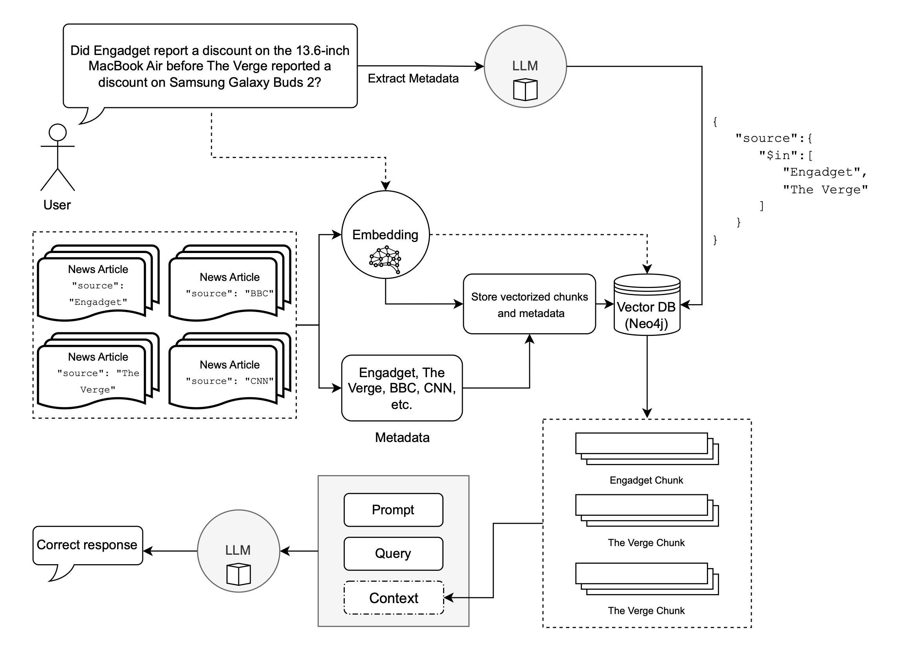

# Multi-Meta-RAG
---
> 🚀 **New Paper:** Check out **MisSynth**, a RAG-based pipeline to generate synthetic data for LLM fine-tuning to detect health misinformation. [**Paper (arXiv)**](https://arxiv.org/abs/2510.26345) | [**Code (GitHub)**](https://github.com/mxpoliakov/MisSynth)
---

## Prerequisites
```shell
# Clone with MultiHop-RAG submodule
git clone --recurse-submodules https://github.com/mxpoliakov/Multi-Meta-RAG.git
# Install requirements (includes forked langchain with nin operator fix)
pip install -r MultiHop-RAG/requirement.txt
pip install -r requirements.txt
```
```shell
# Export env variables as needed
export NEO4J_PASSWORD=
export NEO4J_URI=
export NEO4J_USERNAME=
export VOYAGE_API_KEY=
export OPENAI_API_KEY=
export GOOGLE_CLOUD_PROJECT_ID=
export GOOGLE_CLOUD_LOCATION=
```

## Query metadata filter retrieve
```shell
# Will create query_metadata_filters.json
python query_metadata_filters_retrieve.py
```
## Create and retrieve relevant evidence from vector index
```shell
python create_neo4j_index.py
python retrieve_neo4j_index.py
```
## Run QA
```shell
python qa_google.py
python qa_gpt.py
```
## Evaluation
```
# Evaluate retrieval experiment using MultiHop-RAG evaluation script
cd MultiHop-RAG
python retrieval_evaluate.py --path ../output
```
```
# Evaluate generation accuracy
python evaluate_qa.py
```
